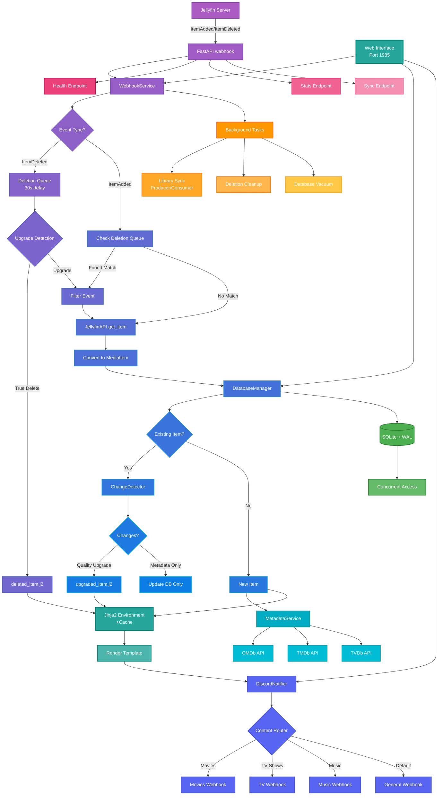

# Jellynouncer

<div align="center">
  
  
  <p align="center">
    <strong>🔔 Intelligent Discord Notifications for Jellyfin Media Server</strong>
  </p>
  
  <p align="center">
    Advanced webhook service with quality upgrade detection, multi-channel routing, and rich customization
  </p>
</div>

<div align="center">

[](https://opensource.org/licenses/MIT)
[](https://www.python.org/downloads/)
[](https://react.dev/)
[](https://hub.docker.com/r/markusmcnugen/jellynouncer)
[](https://github.com/MarkusMcNugen/Jellynouncer/issues)
[](https://github.com/MarkusMcNugen/Jellynouncer/stargazers)
[](https://github.com/MarkusMcNugen/Jellynouncer/releases)

</div>

---

## 📑 Table of Contents

- [Overview](#-overview)
- [What's New in v2.0](#-whats-new-in-v20)
- [Key Features](#-key-features)
  - [Web Interface](#-web-interface)
  - [Smart Change Detection](#-smart-change-detection)
  - [Multi-Channel Discord Routing](#-multi-channel-discord-routing)
  - [Advanced Template System](#-advanced-template-system)
  - [External Metadata Integration](#-external-metadata-integration)
  - [Production-Ready Features](#-production-ready-features)
  - [DevOps Friendly](#-devops-friendly)
- [Quick Start](#-quick-start)
  - [Prerequisites](#prerequisites)
  - [Docker Compose Setup](#docker-compose-recommended)
  - [Docker Run](#docker-run)
- [Web Interface Guide](#-web-interface)
  - [Dashboard / Overview](#-dashboard--overview)
  - [Configuration](#%EF%B8%8F-configuration)
  - [Template Editor](#-template-editor)
  - [Log Viewer](#-log-viewer)
  - [Security](#-security)
- [Configuration](#%EF%B8%8F-configuration-1)
  - [Getting API Keys](#getting-api-keys)
  - [Advanced Configuration](#advanced-configuration)
- [Architecture](#-how-it-works)
- [API Reference](#-api-endpoints)
- [Templates](#-templates)
- [Manual Installation](#-manual-installation)
- [Troubleshooting](#%EF%B8%8F-troubleshooting)
- [Documentation](#-documentation)
- [Contributing](#-contributing)
- [License](#-license)
- [Support](#-support)

---

## 📖 Overview

**Jellynouncer** is an advanced intermediary webhook service that bridges Jellyfin media server with Discord, providing intelligent notifications for media library changes. It goes beyond simple "new item" alerts by detecting quality upgrades, managing multi-channel routing, and offering extensive customization through Jinja2 templates.

The service acts as a smart filter between Jellyfin's webhook events and Discord notifications, analyzing changes to determine what's truly noteworthy - distinguishing between new content additions and quality improvements like resolution upgrades (1080p → 4K) or HDR additions.

> [!WARNING]
> **BETA SOFTWARE NOTICE**
> 
> This software is currently in beta development. While core functionality is stable, you may encounter bugs or edge cases. Please report any issues you find to help improve the service.

## ✨ Key Features

### 🌐 Web Interface

<details open>
<summary><b>Modern Management Dashboard</b></summary>

- **📊 Real-time Dashboard** - Monitor service health, statistics, and recent notifications
- **⚙️ Configuration Manager** - Modify all settings through an intuitive UI
- **📝 Template Editor** - Edit Jinja2 templates with syntax highlighting and live preview
- **📜 Log Viewer** - Browse and filter logs with color-coded severity levels
- **🔐 Optional Authentication** - Secure your web interface with JWT-based authentication
- **🔒 SSL/TLS Support** - Enable HTTPS with your own certificates

</details>

### 🧠 Smart Change Detection

<details>
<summary><b>Intelligent Media Analysis</b></summary>

- **Intelligent Analysis**: Distinguishes between new content and quality upgrades
- **Technical Detection**: Identifies resolution improvements, codec upgrades (H.264 → H.265), audio enhancements (Stereo → 7.1), and HDR additions
- **Content Hashing**: Uses fingerprinting to prevent duplicate notifications while catching meaningful changes
- **Customizable Triggers**: Configure which changes warrant notifications
- **Rename Filtering**: Automatically detects and filters out file renames (same content, different path)
- **Upgrade Detection**: Intelligently handles file upgrades by filtering deletion notifications when followed by additions

</details>

### 🚀 Multi-Channel Discord Routing

<details>
<summary><b>Advanced Notification Management</b></summary>

- **Content-Type Routing**: Automatically routes movies, TV shows, and music to different Discord channels
- **Flexible Webhooks**: Support for unlimited custom webhooks with granular control
- **Smart Fallback**: Ensures no notifications are lost with configurable fallback webhooks
- **Grouping Options**: Batch notifications by event type or content type
- **Rate Limiting**: Respects Discord's API limits with intelligent queueing

</details>

### 🎨 Advanced Template System

<details>
<summary><b>Customizable Discord Embeds</b></summary>

- **Jinja2 Templates**: Fully customizable Discord embed messages
- **Rich Media Information**: Display posters, technical specs, ratings, cast, and plot summaries
- **Multiple Templates**: Different templates for new items, upgrades, and grouped notifications
- **Dynamic Content**: Templates can access all media metadata and technical information
- **Web Editor**: Edit templates directly in the web interface with syntax highlighting

</details>

### 📊 External Metadata Integration

<details>
<summary><b>Enhanced Media Information</b></summary>

- **Rating Services**: Integrates with OMDb, TMDb, and TVDB for ratings and additional metadata
- **Poster Management**: Automatic thumbnail generation and caching for Discord embeds
- **Fallback Handling**: Gracefully handles API failures without breaking notifications
- **Metadata Caching**: Reduces API calls with intelligent caching

</details>

### ⚡ Production-Ready Features

<details>
<summary><b>Enterprise-Grade Reliability</b></summary>

- **Database Persistence**: SQLite with WAL mode for concurrent access and change tracking
- **Intelligent Queue System**: Never lose notifications with automatic queueing during rate limits
  - Handles up to 500 queued notifications for large library updates
  - Automatic retry with exponential backoff (3 attempts)
  - Real-time queue statistics via web interface or `/stats` endpoint
  - Graceful processing during Discord rate limits (30/minute)
- **Background Sync**: Periodic library synchronization to catch missed webhooks
- **Health Monitoring**: Built-in health checks and diagnostic endpoints
- **Structured Logging**: Comprehensive logging with rotation and multiple output levels

</details>

### 🔧 DevOps Friendly

<details>
<summary><b>Easy Deployment & Management</b></summary>

- **Docker-First Design**: Optimized container with multi-stage builds
- **Environment Overrides**: All settings configurable via environment variables
- **Configuration Validation**: Automatic validation with detailed error reporting
- **Graceful Shutdown**: Proper cleanup and queue processing on shutdown
- **Web Management**: Full control through web interface on port 1985
- **Health Checks**: Docker-compatible health endpoints

</details>

## 🚀 Quick Start

### Prerequisites

- **Jellyfin Server** 10.8+ with [Webhook Plugin](https://github.com/jellyfin/jellyfin-plugin-webhook) installed
- **Discord Server** with webhook creation permissions
- **Docker** (recommended) or Python 3.13+ for manual installation

### Docker Compose (Recommended)

<details>
<summary><b>📦 View Docker Compose Setup</b></summary>

1. **Create directory structure:**
```bash
mkdir jellynouncer && cd jellynouncer
mkdir config data logs templates
```

2. **Create `docker-compose.yml`:**
```yaml
version: '3.8'

services:
  jellynouncer:
    image: markusmcnugen/jellynouncer:latest
    container_name: jellynouncer
    restart: unless-stopped
    ports:
      - "1984:1984"  # Webhook service
      - "1985:1985"  # Web interface (HTTP)
      - "9000:9000"  # Web interface (HTTPS - optional)
    environment:
      # Required
      - JELLYFIN_SERVER_URL=http://your-jellyfin-server:8096
      - JELLYFIN_API_KEY=your_api_key_here
      - JELLYFIN_USER_ID=your_user_id_here
      - DISCORD_WEBHOOK_URL=https://discord.com/api/webhooks/your/webhook
      
      # Optional: Content-specific webhooks
      - DISCORD_WEBHOOK_URL_MOVIES=https://discord.com/api/webhooks/movies
      - DISCORD_WEBHOOK_URL_TV=https://discord.com/api/webhooks/tv
      - DISCORD_WEBHOOK_URL_MUSIC=https://discord.com/api/webhooks/music
      
      # Optional: External APIs for enhanced metadata
      - OMDB_API_KEY=your_omdb_key
      - TMDB_API_KEY=your_tmdb_key
      - TVDB_API_KEY=your_tvdb_key
      
      # Optional: Web interface security
      - JWT_SECRET_KEY=your-secret-key-here  # Auto-generated if not set
      
      # System
      - PUID=1000
      - PGID=1000
      - TZ=America/New_York
      - LOG_LEVEL=INFO
      - JELLYNOUNCER_RUN_MODE=all  # all, webhook, or web
    volumes:
      - ./config:/app/config
      - ./data:/app/data
      - ./logs:/app/logs
      - ./templates:/app/templates
      # Optional: Custom web assets
      # - ./web/public:/app/web/dist/assets:ro
    healthcheck:
      test: ["CMD", "curl", "-f", "http://localhost:1984/health"]
      interval: 300s
      timeout: 10s
      retries: 3
      start_period: 10s
```

3. **Start the service:**
```bash
docker-compose up -d
```

4. **Access the services:**
   - Web Interface: `http://your-server:1985`
   - Webhook Endpoint: `http://your-server:1984/webhook`

5. **Configure Jellyfin Webhook Plugin:**
   - Go to Jellyfin Dashboard → Plugins → Webhook
   - Add new webhook with URL: `http://your-server:1984/webhook`
   - Enable "Item Added" event
   - Enable "Item Deleted" event (optional, for deletion notifications)
   - Check "Send All Properties"
   - Save configuration

</details>

### Docker Run

<details>
<summary><b>🐳 View Docker Run Command</b></summary>

```bash
docker run -d \
  --name jellynouncer \
  --restart unless-stopped \
  -p 1984:1984 \
  -p 1985:1985 \
  -p 9000:9000 \
  -e JELLYFIN_SERVER_URL=http://jellyfin:8096 \
  -e JELLYFIN_API_KEY=your_api_key \
  -e JELLYFIN_USER_ID=your_user_id \
  -e DISCORD_WEBHOOK_URL=https://discord.com/api/webhooks/... \
  -v ./config:/app/config \
  -v ./data:/app/data \
  -v ./logs:/app/logs \
  -v ./templates:/app/templates \
  markusmcnugen/jellynouncer:latest
```

</details>

## 🌐 Web Interface

> [!TIP]
> The web interface is available at `http://your-server:1985` and provides full control over Jellynouncer without manual configuration editing.

### 📊 Dashboard / Overview

The dashboard provides real-time insights into your Jellynouncer instance:

| Component | Description |
|-----------|-------------|
| **Service Health** | Live status of all components (Jellyfin, Discord, Database, APIs) |
| **Statistics Cards** | Total notifications, queue size, database items, uptime metrics |
| **Recent Notifications** | Live feed of the last 50 notifications with details |
| **Queue Status** | Current queue size with rate limit information |
| **Background Tasks** | Status of sync, cleanup, and maintenance tasks |
| **Charts** | Notifications over time, content distribution, success rates |

### ⚙️ Configuration

The configuration page allows you to modify all settings through an intuitive interface:

<details>
<summary><b>View Configuration Sections</b></summary>

#### **Jellyfin Settings**
- Server URL, API key, and User ID
- Connection testing and validation
- Library selection and filtering

#### **Discord Settings**
- Main webhook URL configuration
- Content-specific webhook routing (Movies, TV, Music)
- Grouping settings (mode, delay, max items)
- Rate limiting configuration

#### **Notification Settings**
- Change detection toggles (resolution, codec, audio, HDR)
- Filter options (renames, deletes, upgrades)
- Minimum quality thresholds
- Notification templates selection

#### **External APIs**
- OMDb, TMDb, TVDB API keys
- API testing and validation
- Fallback behavior configuration

#### **Advanced Settings**
- Database maintenance intervals
- Sync frequency and batch sizes
- Log levels and retention
- Performance tuning

</details>

> [!IMPORTANT]
> Changes made in the configuration page are applied immediately and persist across restarts.

### 📝 Template Editor

The template editor provides a powerful environment for customizing Discord notifications:

- **Syntax Highlighting**: Full Jinja2 syntax highlighting with Monaco Editor
- **Template Library**: All templates displayed in a tree view
- **Live Preview**: Test templates with sample data before saving
- **Variable Reference**: Quick access panel showing all available variables
- **Template Types**:
  - Individual notifications (`new_item.j2`, `upgraded_item.j2`)
  - Grouped notifications (by event type or content type)
  - Deletion notifications (`deleted_item.j2`)
- **Version Control**: Automatic backup of templates before editing
- **Validation**: Real-time syntax checking and error highlighting

<details>
<summary><b>Available Template Variables</b></summary>

```jinja2
{{ item.name }}              # Media title
{{ item.year }}              # Release year
{{ item.overview }}          # Plot summary
{{ item.video_height }}      # Resolution (1080, 2160)
{{ item.video_codec }}       # Codec (h264, hevc)
{{ item.audio_codec }}       # Audio codec
{{ item.audio_channels }}    # Channel layout (2.0, 5.1, 7.1)
{{ item.video_range }}       # HDR type (SDR, HDR, HDR10+, DV)
{{ item.imdb_rating }}       # IMDb rating
{{ item.tmdb_rating }}       # TMDb rating
{{ item.tvdb_rating }}       # TVDB rating
{{ item.genres }}            # Genre list
{{ item.cast }}              # Cast members
{{ item.runtime }}           # Runtime in minutes
{{ item.file_size_mb }}      # File size in MB
{{ item.container }}         # Container format
{{ item.poster_url }}        # Poster image URL
```

</details>

### 📜 Log Viewer

The log viewer provides comprehensive logging insights:

| Feature | Description |
|---------|-------------|
| **Real-time Updates** | Logs update automatically as new entries are created |
| **Severity Filtering** | Filter by DEBUG, INFO, WARNING, ERROR, CRITICAL |
| **Component Filtering** | Filter by specific components |
| **Search** | Full-text search across all log entries |
| **Color Coding** | Visual severity indicators |
| **Time Range** | Filter logs by time range |
| **Export** | Download logs for offline analysis |

### 🔐 Security

The web interface includes optional security features:

<details>
<summary><b>Authentication Setup</b></summary>

#### **Enabling Authentication**

Authentication is **disabled by default**. To enable:

1. Navigate to Settings → Security in the web interface
2. Toggle "Enable Authentication"
3. Create your admin account:
   - Username (3-50 characters, alphanumeric)
   - Password (minimum 8 characters)
   - Email (optional)
4. Click "Save Settings"

#### **JWT Token Management**
- Access tokens expire after 30 minutes
- Refresh tokens valid for 7 days
- Automatic token refresh in the background
- Secure HTTP-only cookies for token storage

#### **Password Security**
- Bcrypt hashing with unique salts
- Configurable work factor for future-proofing
- No password storage in plain text
- Password reset functionality

</details>

<details>
<summary><b>SSL/TLS Configuration</b></summary>

#### **Enabling HTTPS**

SSL/TLS is **disabled by default**. To enable:

1. Navigate to Settings → SSL/TLS in the web interface
2. Toggle "Enable SSL/TLS"
3. Choose certificate format:
   - **PFX/PKCS12**: Upload single file with password
   - **PEM**: Upload separate certificate and key files
4. Configure port (default: 9000)
5. Click "Apply"

#### **Certificate Management**
- Automatic certificate validation
- Expiry monitoring and warnings
- CSR generation for certificate requests
- Support for self-signed certificates

> [!CAUTION]
> You must provide your own SSL certificates. Jellynouncer does not generate certificates automatically for security reasons.

</details>

## ⚙️ Configuration

### Getting API Keys

<details>
<summary><b>🔑 View API Key Instructions</b></summary>

#### Jellyfin Credentials
1. **API Key**: Dashboard → API Keys → Add Key
2. **User ID**: Dashboard → Users → Select User → Copy ID from URL

#### Discord Webhook
1. Server Settings → Integrations → Webhooks
2. Create webhook for desired channel
3. Copy webhook URL

#### Optional External APIs
- **OMDb**: Free key at [omdbapi.com](http://www.omdbapi.com/apikey.aspx) (1,000 requests/day)
- **TMDb**: Free at [themoviedb.org](https://www.themoviedb.org/settings/api)
- **TVDB**: Register at [thetvdb.com](https://thetvdb.com/api-information)

</details>

### Advanced Configuration

Configuration can be managed through:
1. **Web Interface** (recommended) - `http://your-server:1985`
2. **Environment Variables** - Override any setting
3. **config.json** - Manual file editing

<details>
<summary><b>📋 View config.json Example</b></summary>

```json
{
  "jellyfin": {
    "server_url": "http://jellyfin:8096",
    "api_key": "your_key",
    "user_id": "your_id"
  },
  "discord": {
    "webhooks": {
      "movies": {
        "url": "https://discord.com/api/webhooks/...",
        "enabled": true,
        "grouping": {
          "mode": "both",
          "delay_minutes": 5,
          "max_items": 20
        }
      }
    },
    "routing": {
      "enabled": true,
      "fallback_webhook": "default"
    }
  },
  "notifications": {
    "watch_changes": {
      "resolution": true,
      "codec": true,
      "audio_codec": true,
      "hdr_status": true
    },
    "filter_renames": true,
    "filter_deletes": true
  },
  "web_interface": {
    "auth_enabled": false,
    "ssl_enabled": false,
    "port": 1985,
    "ssl_port": 9000
  }
}
```

</details>

**📚 [Complete Configuration Guide →](config/Readme.md)**

## 🔄 How It Works

### Architecture Overview



## 📡 API Endpoints

### Webhook Service (Port 1984)

| Endpoint | Method | Description |
|----------|--------|-------------|
| `/webhook` | POST | Main webhook receiver from Jellyfin |
| `/health` | GET | Service health and status |
| `/stats` | GET | Comprehensive statistics |
| `/sync` | POST | Trigger manual library synchronization |
| `/validate-templates` | GET | Validate all templates with sample data |
| `/test-webhook` | POST | Send test notification |

### Web Interface API (Port 1985)

| Endpoint | Method | Description |
|----------|--------|-------------|
| `/api/overview` | GET | Dashboard statistics and health |
| `/api/config` | GET/POST | Configuration management |
| `/api/templates` | GET/POST | Template management |
| `/api/logs` | GET | Log retrieval with filtering |
| `/api/auth/login` | POST | User authentication |
| `/api/auth/refresh` | POST | Token refresh |
| `/api/security` | GET/POST | Security settings |
| `/api/ssl` | GET/POST | SSL/TLS configuration |

<details>
<summary><b>📖 View API Examples</b></summary>

```bash
# Check service health
curl http://localhost:1984/health

# View statistics (includes queue metrics)
curl http://localhost:1984/stats

# Trigger sync
curl -X POST http://localhost:1984/sync

# Test specific webhook
curl -X POST "http://localhost:1984/test-webhook?webhook_name=movies"

# Get dashboard data
curl http://localhost:1985/api/overview

# View current configuration
curl http://localhost:1985/api/config

# Get logs (last 100 entries)
curl "http://localhost:1985/api/logs?limit=100"
```

</details>

## 🎨 Templates

Jellynouncer uses Jinja2 templates for complete control over Discord embed formatting. Templates can be edited through the web interface or by modifying files directly.

### Template Types

| Type | Description | Files |
|------|-------------|-------|
| **Individual** | Single item notifications | `new_item.j2`, `upgraded_item.j2`, `deleted_item.j2` |
| **Grouped by Event** | Group by notification type | `new_items_by_event.j2`, `upgraded_items_by_event.j2` |
| **Grouped by Type** | Group by content type | `new_items_by_type.j2`, `upgraded_items_by_type.j2` |
| **Fully Grouped** | Combined grouping | `new_items_grouped.j2`, `upgraded_items_grouped.j2` |

**📚 [Complete Template Guide →](templates/Readme.md)**

## 🔧 Manual Installation

<details>
<summary><b>🛠️ View Manual Installation Steps</b></summary>

### Requirements
- Python 3.13+
- SQLite 3
- Git
- Node.js 20+ (for building web interface)

### Installation Steps

1. **Clone repository:**
```bash
git clone https://github.com/MarkusMcNugen/Jellynouncer.git
cd Jellynouncer
```

2. **Create virtual environment:**
```bash
python -m venv venv
source venv/bin/activate  # Windows: venv\Scripts\activate
```

3. **Install Python dependencies:**
```bash
pip install -r requirements.txt
```

4. **Build web interface:**
```bash
cd web
npm install
npm run build
cd ..
```

5. **Configure:**
```bash
cp config/config.json.example config/config.json
# Edit config.json with your settings
```

6. **Run:**
```bash
python main.py
```

7. **Access services:**
   - Web Interface: `http://localhost:1985`
   - Webhook: `http://localhost:1984`

### Systemd Service (Linux)

Create `/etc/systemd/system/jellynouncer.service`:

```ini
[Unit]
Description=Jellynouncer Discord Webhook Service
After=network.target

[Service]
Type=simple
User=jellynouncer
WorkingDirectory=/opt/jellynouncer
Environment="PATH=/opt/jellynouncer/venv/bin"
ExecStart=/opt/jellynouncer/venv/bin/python main.py
Restart=always

[Install]
WantedBy=multi-user.target
```

Enable and start:
```bash
sudo systemctl enable jellynouncer
sudo systemctl start jellynouncer
```

</details>

## 🛠️ Troubleshooting

### Common Issues

<details>
<summary><b>❓ No notifications received</b></summary>

- Verify Jellyfin webhook plugin is configured correctly
- Check webhook URL points to `http://your-server:1984/webhook`
- Confirm Discord webhook URLs are valid
- Review logs in web interface or at `logs/jellynouncer.log`
- Use the test webhook feature in the web interface

</details>

<details>
<summary><b>❓ Database errors</b></summary>

```bash
# Check permissions
ls -la data/

# Reset database (loses history)
rm data/jellynouncer.db
docker restart jellynouncer
```

</details>

<details>
<summary><b>❓ Rate limiting issues</b></summary>

- Reduce `max_items` in grouping configuration
- Increase `delay_minutes` for batching
- Check Discord rate limits in logs
- Monitor queue status in web interface dashboard

</details>

<details>
<summary><b>❓ Web interface not accessible</b></summary>

- Ensure port 1985 is exposed in Docker
- Check firewall rules
- Verify `JELLYNOUNCER_RUN_MODE` includes web (default: "all")
- Check logs for web service startup errors

</details>

### Debug Mode

Enable comprehensive debug logging to troubleshoot issues:

```yaml
# Docker Compose
environment:
  - LOG_LEVEL=DEBUG
```

```bash
# Manual
export LOG_LEVEL=DEBUG
python main.py
```

When `LOG_LEVEL=DEBUG`, the service will log:
- Complete HTTP request headers (with sensitive values masked)
- Raw request body content
- JSON structure and field analysis
- Webhook payload validation details
- Item deletion queue status
- Metadata API responses
- Discord notification attempts and results

### Log Locations

| Location | Description |
|----------|-------------|
| `logs/jellynouncer.log` | Main application log |
| `logs/jellynouncer-debug.log` | Debug log (when DEBUG enabled) |
| `docker logs jellynouncer` | Container logs |
| `http://your-server:1985` → Logs tab | Web interface log viewer |

## 📚 Documentation

| Document | Description |
|----------|-------------|
| [Configuration Guide](config/Readme.md) | Complete configuration reference |
| [Template Guide](templates/Readme.md) | Template customization and examples |
| [Web Interface Guide](docs/WebInterface.md) | Detailed web interface documentation |
| [API Reference](docs/API.md) | Complete API endpoint documentation |

## 🤝 Contributing

Contributions are welcome! Please feel free to submit a Pull Request.

### Development Setup

1. Fork the repository
2. Create your feature branch (`git checkout -b feature/AmazingFeature`)
3. Commit your changes (`git commit -m 'Add some AmazingFeature'`)
4. Push to the branch (`git push origin feature/AmazingFeature`)
5. Open a Pull Request

### Code Style

- Python 3.13+ with type hints
- PEP 8 compliance (Black formatter, 88 char limit)
- Google-style docstrings
- Comprehensive error handling
- React 19 with TypeScript for web interface
- Tailwind CSS for styling

### Tech Stack

| Layer | Technology |
|-------|------------|
| **Backend** | Python 3.13, FastAPI, SQLite, Pydantic v2 |
| **Frontend** | React 19, Vite 6, Tailwind CSS |
| **Tools** | Docker, ESLint 9, Prettier |
| **Testing** | Pytest, React Testing Library |

## 📄 License

This project is licensed under the MIT License - see the [LICENSE](LICENSE) file for details.

## 🙏 Acknowledgments

- [Jellyfin](https://jellyfin.org/) for the amazing media server
- [Discord](https://discord.com/) for the webhook API
- [FastAPI](https://fastapi.tiangolo.com/) for the modern Python web framework
- [React](https://react.dev/) and [Vite](https://vitejs.dev/) for the web interface
- All contributors and users of this project

## 💬 Support

- **Issues**: [GitHub Issues](https://github.com/MarkusMcNugen/Jellynouncer/issues)
- **Discussions**: [GitHub Discussions](https://github.com/MarkusMcNugen/Jellynouncer/discussions)
- **Wiki**: [GitHub Wiki](https://github.com/MarkusMcNugen/Jellynouncer/wiki)

---

<div align="center">
  <p>
    <strong>Made with ☕ by Mark Newton</strong>
  </p>
  <p>
    <i>If you find this project useful, please consider giving it a ⭐ on GitHub!</i>
  </p>
</div>
