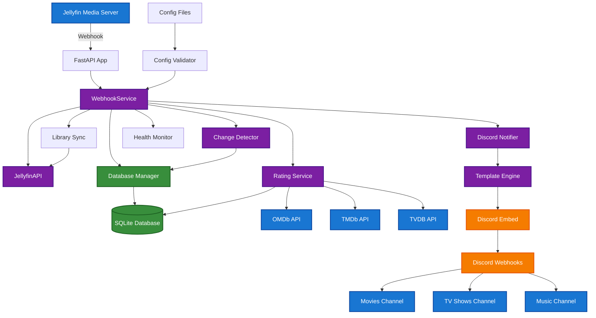

<div align="center">
  
</div>

[](https://opensource.org/licenses/MIT)
[](https://www.python.org/downloads/)
[](https://hub.docker.com/r/your-username/jellynouncer)
[](https://github.com/MarkusMcNugen/Jellynouncer/issues)
[](https://github.com/MarkusMcNugen/Jellynouncer/stargazers)

**Jellynouncer** is a intermediary webhook service that sits between Jellyfin and Discord to process and send new content notifications. It detects new content and quality upgrades, routing notifications to different Discord channels based on content type with customizable embed messages with Jinja2 templates and optional metadata enhancements.

> ⚠️ **ALPHA SOFTWARE WARNING** ⚠️
> 
> **This software is currently in alpha development stage.** This software breaks frequently, it may contain bugs, incomplete features, or undergo significant changes. When a full release is done active development will be switched to a dev branch. This readme is not always updated with the changes, it will be updated periodically but should not be relied on until the software is released.
> 
> - 🔧 **Active Development**: Features and APIs may change without notice
> - 🐛 **Potential Issues**: Bugs and edge cases are still being discovered and fixed  
> - 📋 **Testing**: All testing is done internally until first release whenever that may be

## Table of Contents

- [Key Features](#-key-features)
- [Quick Start](#-quick-start)
  - [Docker Compose (Recommended)](#docker-compose-recommended)
  - [Docker Run](#docker-run)
- [Prerequisites](#-prerequisites)
- [Configuration](#️-configuration)
- [Manual Installation](#-manual-installation)
- [How It Works](#-how-it-works)
- [API Endpoints](#-api-endpoints)
- [Templates](#-templates)
- [Troubleshooting](#-troubleshooting)
- [Contributing](#-contributing)
- [License](#-license)
- [Support](#-support)

## ✨ Key Features

### 🧠 **Smart Change Detection**
- **New vs. Upgraded Content**: Distinguishes between new media and quality upgrades of existing content
- **Technical Analysis**: Detects resolution improvements (1080p → 4K), codec upgrades (H.264 → H.265), audio enhancements (Stereo → 7.1), and HDR additions
- **Content Hashing**: Uses content fingerprinting to avoid duplicate notifications while catching meaningful changes

### 🚀 **Multi-Webhook Routing** 
- **Content-Type Routing**: Routes movies, TV shows, and music to different Discord channels
- **Smart Fallback**: Configurable fallback webhooks ensure no notifications are lost
- **Flexible Configuration**: Support for unlimited custom webhooks with granular control

### 🎨 **Template System**
- **Jinja2 Templates**: Customizable Discord embed templates using Jinja2
- **Rich Media Information**: Display technical specs, plot summaries, cast information, and ratings
- **Grouped Notifications**: Batch multiple items into organized notifications
- **Multiple Template Types**: Different templates for individual items, grouped content, and upgrade notifications

### ⚡ **Reliability Features**
- **Rate Limiting**: Rate limiting prevents Discord API blocks
- **Retry Logic**: Exponential backoff retry handling for network resilience  
- **Background Sync**: Periodic library synchronization catches missed webhook events
- **Health Monitoring**: Health checks and diagnostic endpoints

### 🔧 **Production Ready**
- **Docker-First**: Optimized for containerized deployments with Docker Compose support
- **Configuration Management**: YAML/JSON configuration with environment variable overrides
- **Logging**: Structured logging with rotation and multiple output destinations
- **Database Persistence**: SQLite with WAL mode for concurrent access

## 🚀 Quick Start

### Docker Compose (Recommended)

1. **Create your directory structure:**
   ```bash
   mkdir jellynouncer && cd jellynouncer
   mkdir config data logs templates
   ```

2. **Create `docker-compose.yml`:**
   ```yaml
   version: '3.8'
   
   services:
     jellynouncer:
       image: your-username/jellynouncer:latest
       container_name: jellynouncer
       restart: unless-stopped
       ports:
         - "8080:8080"
       environment:
         # Required Configuration
         - JELLYFIN_SERVER_URL=http://your-jellyfin-server:8096
         - JELLYFIN_API_KEY=your_jellyfin_api_key_here
         - JELLYFIN_USER_ID=your_user_id_here
         - DISCORD_WEBHOOK_URL=https://discord.com/api/webhooks/your/webhook/url
         
         # Optional: Separate webhooks for different content types
         - DISCORD_WEBHOOK_URL_MOVIES=https://discord.com/api/webhooks/your/movies/webhook
         - DISCORD_WEBHOOK_URL_TV=https://discord.com/api/webhooks/your/tv/webhook
         - DISCORD_WEBHOOK_URL_MUSIC=https://discord.com/api/webhooks/your/music/webhook
         
         # Optional: External rating services
         - OMDB_API_KEY=your_omdb_api_key_here
         - TMDB_API_KEY=your_tmdb_api_key_here
         - TVDB_API_KEY=your_tvdb_api_key_here
         
         # System Configuration
         - PUID=1000
         - PGID=1000
         - TZ=America/New_York
       volumes:
         - ./config:/app/config:rw
         - ./data:/app/data:rw
         - ./logs:/app/logs:rw
         - ./templates:/app/templates:rw
       healthcheck:
         test: ["CMD", "curl", "-f", "http://localhost:8080/health"]
         interval: 30s
         timeout: 10s
         retries: 3
         start_period: 10s
   ```

3. **Start the service:**
   ```bash
   docker-compose up -d
   ```

4. **Configure Jellyfin Webhook:**
   - Install the [Jellyfin Webhook Plugin](https://github.com/jellyfin/jellyfin-plugin-webhook)
   - Add webhook URL: `http://your-server:8080/webhook`
   - Select events: `Item Added`
   - Checkbox Send All Properties
   - Save webhook settings

### Docker Run

```bash
docker run -d \
  --name jellynouncer \
  --restart unless-stopped \
  -p 8080:8080 \
  -e JELLYFIN_SERVER_URL=http://your-jellyfin-server:8096 \
  -e JELLYFIN_API_KEY=your_jellyfin_api_key_here \
  -e JELLYFIN_USER_ID=your_user_id_here \
  -e DISCORD_WEBHOOK_URL=https://discord.com/api/webhooks/your/webhook/url \
  -e PUID=1000 \
  -e PGID=1000 \
  -v ./config:/app/config:rw \
  -v ./data:/app/data:rw \
  -v ./logs:/app/logs:rw \
  -v ./templates:/app/templates:rw \
  your-username/jellynouncer:latest
```

## 📋 Prerequisites

### Required
- **Jellyfin Server**: Version 10.8+ with Webhook Plugin installed
- **Discord**: Server with webhook permissions
- **Docker**: For containerized deployment

### Getting API Keys

#### Jellyfin API Key
1. Go to Jellyfin Dashboard → API Keys
2. Click "+" to create new key
3. Copy the generated key

#### Jellyfin User ID
1. Go to Jellyfin Dashboard → Users
2. Click on your user
3. Copy the ID from the browser URL

#### Discord Webhook URL
1. Go to Discord Server → Server Settings → Integrations
2. Click "Create Webhook" or "View Webhooks"
3. Create webhook for desired channel
4. Copy webhook URL

#### Optional: External Rating APIs
- **OMDb**: Free key at [omdbapi.com](http://www.omdbapi.com/apikey.aspx) (1000 requests/day)
- **TMDb**: Free key at [themoviedb.org](https://www.themoviedb.org/settings/api)
- **TVDB**: API key at [thetvdb.com](https://thetvdb.com/api-information)

## ⚙️ Configuration

### Environment Variables

| Variable | Required | Description |
|----------|----------|-------------|
| `JELLYFIN_SERVER_URL` | ✅ | Jellyfin server URL |
| `JELLYFIN_API_KEY` | ✅ | Jellyfin API key |
| `JELLYFIN_USER_ID` | ✅ | Jellyfin user ID |
| `DISCORD_WEBHOOK_URL` | ✅ | Default Discord webhook URL |
| `DISCORD_WEBHOOK_URL_MOVIES` | ❌ | Movies-specific webhook URL |
| `DISCORD_WEBHOOK_URL_TV` | ❌ | TV shows-specific webhook URL |
| `DISCORD_WEBHOOK_URL_MUSIC` | ❌ | Music-specific webhook URL |
| `OMDB_API_KEY` | ❌ | OMDb API key for movie ratings |
| `TMDB_API_KEY` | ❌ | TMDb API key for movie/TV data |
| `TVDB_API_KEY` | ❌ | TVDB API key for TV show data |
| `PUID` | ❌ | User ID for file permissions (default: 1000) |
| `PGID` | ❌ | Group ID for file permissions (default: 1000) |
| `TZ` | ❌ | Timezone (default: UTC) |
| `LOG_LEVEL` | ❌ | Logging level: DEBUG, INFO, WARNING, ERROR, CRITICAL (default: INFO) |

### Configuration Files

For advanced configuration, create a `config/config.json` file:

```json
{
  "jellyfin": {
    "server_url": "http://jellyfin:8096",
    "api_key": "your_api_key_here",
    "user_id": "your_user_id_here"
  },
  "discord": {
    "webhooks": {
      "movies": {
        "name": "🎬 Movies",
        "enabled": true,
        "url": "https://discord.com/api/webhooks/.../movies",
        "grouping": {
          "mode": "event_type",
          "delay_minutes": 3,
          "max_items": 10
        }
      },
      "tv": {
        "name": "📺 TV Shows", 
        "enabled": true,
        "url": "https://discord.com/api/webhooks/.../tv",
        "grouping": {
          "mode": "both",
          "delay_minutes": 5,
          "max_items": 15
        }
      }
    },
    "routing": {
      "enabled": true,
      "fallback_webhook": "movies"
    }
  }
}
```

**📖 [Complete Configuration Guide →](config/Readme.md)**

## 🔧 Manual Installation

### Requirements

- Python 3.11+
- SQLite 3
- Git

### Installation Steps

1. **Clone the repository:**
   ```bash
   git clone https://github.com/MarkusMcNugen/Jellynouncer.git
   cd Jellynouncer
   ```

2. **Create virtual environment:**
   ```bash
   python -m venv venv
   source venv/bin/activate  # On Windows: venv\Scripts\activate
   ```

3. **Install dependencies:**
   ```bash
   pip install -r requirements.txt
   ```

4. **Create directories:**
   ```bash
   mkdir -p data logs config templates
   ```

5. **Copy default configuration:**
   ```bash
   cp config/config.json.example config/config.json
   ```

6. **Edit configuration:**
   ```bash
   nano config/config.json  # Add your Jellyfin and Discord settings
   ```

7. **Run the service:**
   ```bash
   python main.py
   ```

### Systemd Service (Linux)

Create `/etc/systemd/system/jellynouncer.service`:

```ini
[Unit]
Description=Jellynouncer Discord Webhook Service
After=network.target

[Service]
Type=simple
User=jellynouncer
WorkingDirectory=/opt/jellynouncer
Environment=PATH=/opt/jellynouncer/venv/bin
ExecStart=/opt/jellynouncer/venv/bin/python main.py
Restart=always
RestartSec=10

[Install]
WantedBy=multi-user.target
```

Enable and start:
```bash
sudo systemctl enable jellynouncer
sudo systemctl start jellynouncer
```

## 🔄 How It Works

### Architecture Overview



### Detailed Component Flow

#### 1. **Webhook Reception & Validation**
```
Jellyfin Server → FastAPI App → WebhookService → Payload Validation
```

#### 2. **Media Processing Pipeline**
```
Webhook Payload → Media Item Extraction → Database Lookup → Change Detection
```

#### 3. **Change Detection Logic**
```
Current Item → Content Hash → Database Comparison → Change Classification → Notification Decision
```

#### 4. **External Data Enrichment**
```
Media Item → Rating Services → [OMDb/TMDb/TVDB APIs] → Enhanced Metadata → Database Cache
```

#### 5. **Discord Notification Flow**
```
Notification Decision → Webhook Router → Template Selection → Jinja2 Rendering → Discord API → Multiple Channels
```

#### 6. **Background Operations**
```
Library Sync → Jellyfin API → Database Updates → Health Monitoring → Maintenance Tasks
```

### Smart Change Detection

1. **Content Analysis**: When Jellyfin sends a webhook, Jellynouncer analyzes the media item's technical specifications
2. **Content Hash Generation**: Creates a unique fingerprint based on important media properties  
3. **Database Comparison**: Compares against stored data to determine if this is new content or an upgrade
4. **Change Classification**: Identifies specific improvements (resolution, codec, audio, HDR)
5. **Significance Filtering**: Decides whether changes are significant enough to warrant notification

### Multi-Webhook Routing & Template Processing

1. **Content Type Detection**: Analyzes the item type (Movie, Episode, Audio, etc.)
2. **Routing Rules**: Applies configured routing rules to select appropriate webhook
3. **Fallback Logic**: Uses fallback webhook if specific webhook is unavailable
4. **Template Selection**: Chooses appropriate template based on content and notification type
5. **Data Collection**: Gathers all available metadata for the media item
6. **Template Loading**: Loads appropriate Jinja2 template
7. **Rendering**: Processes template with media data to generate Discord embed JSON
8. **Validation**: Validates generated JSON meets Discord API requirements

### External API Integration

1. **Rating Enrichment**: Fetches additional ratings and metadata from external sources
2. **Caching Strategy**: Stores external data locally to reduce API calls and improve performance
3. **Fallback Handling**: Gracefully handles API failures without breaking notifications
4. **Rate Limiting**: Respects external API rate limits to maintain service reliability

### Background Services

1. **Library Synchronization**: Periodically syncs with Jellyfin to ensure database consistency
2. **Health Monitoring**: Continuously monitors service health and external API availability  
3. **Database Maintenance**: Performs cleanup, optimization, and backup operations
4. **Configuration Watching**: Monitors configuration changes and applies updates dynamically

## 📡 API Endpoints

| Endpoint | Method | Description |
|----------|--------|-------------|
| `/webhook` | POST | Main webhook endpoint for Jellyfin |
| `/health` | GET | Health check and service status |
| `/stats` | GET | Database and service statistics |
| `/sync` | POST | Trigger manual library synchronization |
| `/webhooks` | GET | List configured Discord webhooks |
| `/queues` | GET | Show notification queue status |
| `/flush-queues` | POST | Process all queued notifications |
| `/test-webhook` | POST | Send test notification to specific webhook |

### Usage Examples

**Health Check:**
```bash
curl http://localhost:8080/health
```

**Manual Sync:**
```bash
curl -X POST http://localhost:8080/sync
```

**Test Webhook:**
```bash
curl -X POST "http://localhost:8080/test-webhook?webhook_name=movies"
```

**Queue Status:**
```bash
curl http://localhost:8080/queues
```

## 🎨 Templates

Jellynouncer uses Jinja2 templates to generate Discord embeds. Templates can be customized without changing code.

### Template Types

- **Individual Notifications**: `new_item.j2`, `upgraded_item.j2`
- **Grouped Notifications**: `new_items_grouped.j2`, `upgraded_items_grouped.j2`
- **Content-Specific**: Templates for movies, TV shows, music

### Template Variables

```jinja2
{{ item.name }}              <!-- Media title -->
{{ item.item_type }}         <!-- "Movie", "Episode", etc. -->
{{ item.year }}              <!-- Release year -->
{{ item.video_height }}      <!-- Resolution (1080, 2160) -->
{{ item.video_codec }}       <!-- "h264", "hevc", etc. -->
{{ item.audio_codec }}       <!-- "ac3", "dts", etc. -->
{{ item.overview }}          <!-- Plot summary -->
```

### Example Template

```jinja2
{
  "embeds": [
    {
      "title": "🎬 New {{ item.item_type }} Added",
      "description": "**{{ item.name }}** ({{ item.year }})",
      "color": {{ color }},
      "fields": [
        
        {
          "name": "Quality",
          "value": "{{ item.video_height }}p",
          "inline": true
        }
        
      ]
    }
  ]
}
```

**📖 [Complete Template Guide →](templates/Readme.md)**

## 🛠️ Troubleshooting

### Common Issues

**Service won't start:**
```bash
# Check logs
docker logs jellynouncer

# Verify configuration
curl http://localhost:8080/health
```

**No notifications:**
- Verify Jellyfin webhook plugin is installed and configured
- Check webhook URL in Jellyfin points to: `http://your-server:8080/webhook`
- Verify Discord webhook URLs are correct
- Check service logs for errors

**Database errors:**
```bash
# Check database file permissions
ls -la data/

# Reset database (will lose history)
rm data/jellynouncer.db
docker restart jellynouncer
```

**Template errors:**
- Verify template files exist in `templates/` directory
- Check Jinja2 syntax in custom templates
- Validate JSON output using online JSON validator

### Debug Mode

Enable debug logging for detailed troubleshooting:

**Docker Compose:**
```yaml
environment:
  - LOG_LEVEL=DEBUG
```

**Docker Run:**
```bash
docker run -e LOG_LEVEL=DEBUG ...
```

**Manual Installation:**
```bash
export LOG_LEVEL=DEBUG
python main.py
```

### Log Files

- **Application logs**: `logs/jellynouncer.log`
- **Debug logs**: When `LOG_LEVEL=DEBUG` is set, additional detailed logs are written to `logs/jellynouncer-debug.log`
- **Container startup logs**: Docker entrypoint provides detailed initialization logging including:
  - Configuration file processing
  - Directory creation and permissions
  - Template and script file copying
  - Environment variable validation
  - System diagnostics and health checks
- **Runtime logs**: Console output available via `docker logs jellynouncer`

### Debug Information

When debug mode is enabled, you'll see additional information:
- **Webhook Processing**: Detailed payload analysis and processing steps
- **Database Operations**: SQL queries and transaction details  
- **Template Rendering**: Template loading and variable substitution details
- **API Calls**: Full HTTP request/response details for Jellyfin and Discord APIs
- **Change Detection**: Detailed comparison logic and decision reasoning
- **Container Initialization**: Comprehensive startup process logging from the entrypoint script

## 📚 Documentation

| Document | Description |
|----------|-------------|
| [Configuration Guide](config/Readme.md) | Complete configuration options and examples |
| [Template Guide](templates/Readme.md) | Template customization and examples |
| [Advanced Templates](templates/Readme-AdvancedTemplates.md) | Advanced template features and techniques |

## 🤝 Contributing

We welcome contributions! Please see our [Contributing Guidelines](https://github.com/MarkusMcNugen/Jellynouncer/blob/main/CONTRIBUTING.md).

### Development Setup

1. Fork the repository
2. Create a feature branch: `git checkout -b feature-name`
3. Make changes and test thoroughly
4. Submit a pull request

### Reporting Issues

- **Bug Reports**: Use our [bug report template](https://github.com/MarkusMcNugen/Jellynouncer/issues/new?assignees=&labels=bug&template=bug_report.md&title=)
- **Feature Requests**: Use our [feature request template](https://github.com/MarkusMcNugen/Jellynouncer/issues/new?assignees=&labels=enhancement&template=feature_request.md&title=)

## 📄 License

This project is licensed under the MIT License - see the [LICENSE](LICENSE) file for details.

## 💬 Support

- **Documentation**: Check the guides linked above
- **Issues**: [GitHub Issues](https://github.com/MarkusMcNugen/Jellynouncer/issues)
- **Discussions**: [GitHub Discussions](https://github.com/MarkusMcNugen/Jellynouncer/discussions)

---

**Made with ☕ by Mark Newton**
