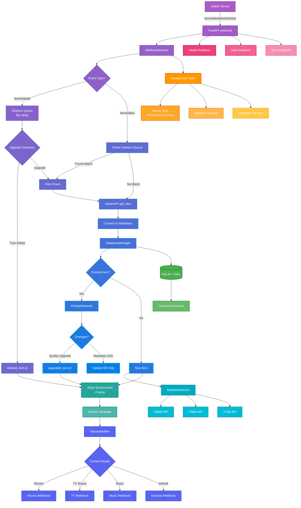

# Jellynouncer

<div align="center">
  
</div>

<div align="center">

[](https://opensource.org/licenses/MIT)
[](https://www.python.org/downloads/)
[](https://hub.docker.com/r/markusmcnugen/jellynouncer)
[](https://github.com/MarkusMcNugen/Jellynouncer/issues)
[](https://github.com/MarkusMcNugen/Jellynouncer/stargazers)
[](https://github.com/MarkusMcNugen/Jellynouncer/releases)

</div>

## 📖 Overview

**Jellynouncer** is an advanced intermediary webhook service that bridges Jellyfin media server with Discord, providing intelligent notifications for media library changes. It goes beyond simple "new item" alerts by detecting quality upgrades, managing multi-channel routing, and offering extensive customization through Jinja2 templates.

The service acts as a smart filter between Jellyfin's webhook events and Discord notifications, analyzing changes to determine what's truly noteworthy - distinguishing between new content additions and quality improvements like resolution upgrades (1080p → 4K) or HDR additions.

> ⚠️ **BETA SOFTWARE NOTICE**
> 
> This software is currently in beta development. While core functionality is stable, you may encounter bugs or edge cases. Please report any issues you find to help improve the service.

## ✨ Key Features

### 🧠 Smart Change Detection
- **Intelligent Analysis**: Distinguishes between new content and quality upgrades
- **Technical Detection**: Identifies resolution improvements, codec upgrades (H.264 → H.265), audio enhancements (Stereo → 7.1), and HDR additions
- **Content Hashing**: Uses fingerprinting to prevent duplicate notifications while catching meaningful changes
- **Customizable Triggers**: Configure which changes warrant notifications
- **Rename Filtering**: Automatically detects and filters out file renames (same content, different path)
- **Upgrade Detection**: Intelligently handles file upgrades by filtering deletion notifications when followed by additions

### 🚀 Multi-Channel Discord Routing
- **Content-Type Routing**: Automatically routes movies, TV shows, and music to different Discord channels
- **Flexible Webhooks**: Support for unlimited custom webhooks with granular control
- **Smart Fallback**: Ensures no notifications are lost with configurable fallback webhooks
- **Grouping Options**: Batch notifications by event type or content type

### 🎨 Advanced Template System
- **Jinja2 Templates**: Fully customizable Discord embed messages
- **Rich Media Information**: Display posters, technical specs, ratings, cast, and plot summaries
- **Multiple Templates**: Different templates for new items, upgrades, and grouped notifications
- **Dynamic Content**: Templates can access all media metadata and technical information

### 📊 External Metadata Integration
- **Rating Services**: Integrates with OMDb, TMDb, and TVDB for ratings and additional metadata
- **Poster Management**: Automatic thumbnail generation and caching for Discord embeds
- **Fallback Handling**: Gracefully handles API failures without breaking notifications

### ⚡ Production-Ready Features
- **Database Persistence**: SQLite with WAL mode for concurrent access and change tracking
- **Intelligent Queue System**: Never lose notifications with automatic queueing during rate limits
  - Handles up to 1000 queued notifications for large library updates
  - Automatic retry with exponential backoff (3 attempts)
  - Real-time queue statistics via `/stats` endpoint
  - Graceful processing during Discord rate limits (30/minute)
- **Rate Limiting**: Respects Discord API limits with configurable rate limiting
- **Retry Logic**: Exponential backoff for network resilience
- **Background Sync**: Periodic library synchronization to catch missed webhooks
- **Health Monitoring**: Built-in health checks and diagnostic endpoints
- **Structured Logging**: Comprehensive logging with rotation and multiple output levels

### 🔧 DevOps Friendly
- **Docker-First Design**: Optimized container with multi-stage builds
- **Environment Overrides**: All settings configurable via environment variables
- **Configuration Validation**: Automatic validation with detailed error reporting
- **Graceful Shutdown**: Proper cleanup and queue processing on shutdown

## 🚀 Quick Start

### Prerequisites

- **Jellyfin Server** 10.8+ with [Webhook Plugin](https://github.com/jellyfin/jellyfin-plugin-webhook) installed
- **Discord Server** with webhook creation permissions
- **Docker** (recommended) or Python 3.11+ for manual installation

### Docker Compose (Recommended)

1. **Create directory structure:**
```bash
mkdir jellynouncer && cd jellynouncer
mkdir config data logs templates
```

2. **Create `docker-compose.yml`:**
```yaml
version: '3.8'

services:
  jellynouncer:
    image: markusmcnugen/jellynouncer:latest
    container_name: jellynouncer
    restart: unless-stopped
    ports:
      - "8080:8080"
    environment:
      # Required
      - JELLYFIN_SERVER_URL=http://your-jellyfin-server:8096
      - JELLYFIN_API_KEY=your_api_key_here
      - JELLYFIN_USER_ID=your_user_id_here
      - DISCORD_WEBHOOK_URL=https://discord.com/api/webhooks/your/webhook
      
      # Optional: Content-specific webhooks
      - DISCORD_WEBHOOK_URL_MOVIES=https://discord.com/api/webhooks/movies
      - DISCORD_WEBHOOK_URL_TV=https://discord.com/api/webhooks/tv
      - DISCORD_WEBHOOK_URL_MUSIC=https://discord.com/api/webhooks/music
      
      # Optional: External APIs for enhanced metadata
      - OMDB_API_KEY=your_omdb_key
      - TMDB_API_KEY=your_tmdb_key
      - TVDB_API_KEY=your_tvdb_key
      
      # System
      - PUID=1000
      - PGID=1000
      - TZ=America/New_York
      - LOG_LEVEL=INFO
    volumes:
      - ./config:/app/config
      - ./data:/app/data
      - ./logs:/app/logs
      - ./templates:/app/templates
    healthcheck:
      test: ["CMD", "curl", "-f", "http://localhost:8080/health"]
      interval: 300s
      timeout: 10s
      retries: 3
      start_period: 10s
```

3. **Start the service:**
```bash
docker-compose up -d
```

4. **Configure Jellyfin Webhook Plugin:**
   - Go to Jellyfin Dashboard → Plugins → Webhook
   - Add new webhook with URL: `http://your-server:8080/webhook`
   - Enable "Item Added" event
   - Enable "Item Deleted" event (optional, for deletion notifications)
   - Check "Send All Properties"
   - Save configuration

### Docker Run

1. **Run the container:**
```bash
docker run -d \
  --name jellynouncer \
  --restart unless-stopped \
  -p 8080:8080 \
  -e JELLYFIN_SERVER_URL=http://jellyfin:8096 \
  -e JELLYFIN_API_KEY=your_api_key \
  -e JELLYFIN_USER_ID=your_user_id \
  -e DISCORD_WEBHOOK_URL=https://discord.com/api/webhooks/... \
  -v ./config:/app/config \
  -v ./data:/app/data \
  -v ./logs:/app/logs \
  -v ./templates:/app/templates \
  markusmcnugen/jellynouncer:latest
```

2. **Configure Jellyfin Webhook Plugin:**
   - Go to Jellyfin Dashboard → Plugins → Webhook
   - Add new webhook with URL: `http://your-server:8080/webhook`
   - Enable "Item Added" event
   - Enable "Item Deleted" event (optional, for deletion notifications)
   - Check "Send All Properties"
   - Save configuration

## ⚙️ Configuration

### Getting API Keys

#### Jellyfin Credentials
1. **API Key**: Dashboard → API Keys → Add Key
2. **User ID**: Dashboard → Users → Select User → Copy ID from URL

#### Discord Webhook
1. Server Settings → Integrations → Webhooks
2. Create webhook for desired channel
3. Copy webhook URL

#### Optional External APIs
- **OMDb**: Free key at [omdbapi.com](http://www.omdbapi.com/apikey.aspx) (1,000 requests/day)
- **TMDb**: Free at [themoviedb.org](https://www.themoviedb.org/settings/api)
- **TVDB**: Register at [thetvdb.com](https://thetvdb.com/api-information)

### Advanced Configuration

Create `config/config.json` for advanced settings:

```json
{
  "jellyfin": {
    "server_url": "http://jellyfin:8096",
    "api_key": "your_key",
    "user_id": "your_id"
  },
  "discord": {
    "webhooks": {
      "movies": {
        "url": "https://discord.com/api/webhooks/...",
        "enabled": true,
        "grouping": {
          "mode": "both",
          "delay_minutes": 5,
          "max_items": 20
        }
      }
    },
    "routing": {
      "enabled": true,
      "fallback_webhook": "default"
    }
  },
  "notifications": {
    "watch_changes": {
      "resolution": true,
      "codec": true,
      "audio_codec": true,
      "hdr_status": true
    },
    "filter_renames": true,
    "filter_deletes": true
  }
}
```

**📚 [Complete Configuration Guide →](config/Readme.md)**

### 🎯 Smart Filtering Features

#### Deletion Notifications & Filtering

Jellynouncer supports **ItemDeleted** webhooks from Jellyfin, with intelligent filtering to prevent spam:

##### **Filter Renames** (`filter_renames`)
When enabled (default: `true`), Jellynouncer intelligently detects file renames and filters out unnecessary notifications:
- Detects when a file is deleted and immediately re-added with the same content
- Compares media properties to identify renames vs actual changes
- Prevents "deleted" + "added" notification spam for simple file moves

##### **Filter Deletes** (`filter_deletes`)
When enabled (default: `true`), Jellynouncer intelligently handles upgrade scenarios:
- Delays deletion notifications by 30 seconds to detect upgrades
- When Jellyfin upgrades a file (e.g., 1080p → 4K), it sends delete + add events
- Jellynouncer detects this pattern and only sends the upgrade notification
- True deletions (not followed by additions) are still notified after the delay

#### Configuration Options

**Environment Variables:**
```bash
FILTER_RENAMES=true    # Filter out rename notifications
FILTER_DELETES=true    # Filter deletion notifications for upgrades
```

**config.json:**
```json
{
  "notifications": {
    "filter_renames": true,
    "filter_deletes": true
  }
}
```

#### Template Support

New deletion templates are available:
- `deleted_item.j2` - Standard deletion notification template
- Custom templates can be created following the same structure

## 🔄 How It Works

### Architecture Overview



### Detailed Component Flow

#### 1. **Webhook Reception & Validation**
```
Jellyfin Event → Webhook Plugin → POST /webhook → FastAPI Validation → WebhookPayload Model
```
- Jellyfin detects library changes (ItemAdded/ItemDeleted) and triggers webhook
- FastAPI validates incoming payload structure
- Pydantic models ensure type safety and data integrity
- Event type determines processing path (addition/deletion/update)

#### 2. **Deletion Filtering Pipeline**
```
ItemDeleted → Deletion Queue (30s) → Upgrade Detection → True Delete vs Upgrade Filter
```
- ItemDeleted events enter deletion queue if `filter_deletes=true`
- 30-second delay allows detection of upgrade patterns
- Matches deletions with subsequent additions to identify upgrades
- True deletions proceed to notification after timeout

#### 3. **Media Processing Pipeline**
```
ItemAdded → Deletion Check → Rename Detection → Database Lookup → Change Detection
```
- Check deletion queue for matching items (upgrade/rename scenarios)
- Compare file paths and properties for rename detection if `filter_renames=true`
- Query SQLite database for existing item history
- Analyze differences using content hashing algorithm
- Classify as new item, quality upgrade, or filtered event

#### 4. **Metadata Enhancement**
```
JellyfinAPI → External Services (OMDb/TMDb/TVDB) → Metadata Aggregation → Cache Storage
```
- Fetch additional details from Jellyfin API
- Query external services for ratings and additional metadata
- Aggregate all metadata into unified MediaItem object
- Cache results to reduce API calls

#### 5. **Template Processing**
```
Template Selection → Jinja2 Environment → Bytecode Cache → Discord Embed Creation
```
- Select appropriate template (new_item.j2, upgraded_item.j2, deleted_item.j2)
- Render template with Jinja2 environment (8x faster with caching)
- Use bytecode cache for compiled templates
- Generate Discord-compatible JSON embed structure

#### 6. **Notification Routing**
```
Content Type Detection → Webhook Selection → Channel Routing → Rate Limiting
```
- Detect content type (Movie, TV, Music)
- Select configured webhook for content type
- Fall back to default webhook if specific not configured
- Route to appropriate Discord channel

#### 7. **Delivery & Reliability**
```
Rate Limiter → Notification Queue → Discord API → Retry Logic → Success/Failure Handling
```
- Check Discord rate limits (30 requests/minute per webhook)
- Queue notifications automatically when rate limited
- Process queue with intelligent backoff and retry logic
- Track success/failure with comprehensive statistics
- Ensure no notifications lost during large library updates

### Background Services

1. **Library Synchronization**: Periodically syncs with Jellyfin using producer/consumer pattern
2. **Deletion Cleanup**: Processes pending deletions after 30-second timeout for upgrade detection
3. **Queue Processing**: Manages notification batching and grouped notifications
4. **Health Monitoring**: Tracks service health and external API availability
5. **Database Maintenance**: Performs VACUUM operations and WAL checkpoints

## 📡 API Endpoints

| Endpoint | Method | Description |
|----------|--------|-------------|
| `/webhook` | POST | Main webhook receiver from Jellyfin (includes debug logging when LOG_LEVEL=DEBUG) |
| `/health` | GET | Service health and status |
| `/stats` | GET | Comprehensive statistics including database, queue metrics, and notification performance |
| `/sync` | POST | Trigger manual library synchronization |
| `/webhooks` | GET | List configured Discord webhooks |
| `/queues` | GET | Show notification queue status |
| `/flush-queues` | POST | Process all pending notifications |
| `/test-webhook` | POST | Send test notification |
| `/validate-templates` | GET | Validate all templates with sample data |

### Example API Usage

```bash
# Check service health
curl http://localhost:8080/health

# View statistics (includes queue metrics)
curl http://localhost:8080/stats
# Returns: {
#   "notification_queue": {
#     "current_queue_size": 0,
#     "total_queued": 42,
#     "total_sent": 40,
#     "total_failed": 2,
#     "total_retried": 5,
#     "rate_limit_hits": 3,
#     "queue_utilization": 0.0,
#     "success_rate": 95.2
#   },
#   "database": {...},
#   "webhooks": {...}
# }

# Trigger sync
curl -X POST http://localhost:8080/sync

# Test specific webhook
curl -X POST "http://localhost:8080/test-webhook?webhook_name=movies"

# Validate templates
curl http://localhost:8080/validate-templates
```

## 🎨 Templates

Jellynouncer uses Jinja2 templates for complete control over Discord embed formatting.

### Template Types

- **Individual**: `new_item.j2`, `upgraded_item.j2`, `deleted_item.j2`
- **Grouped by Event**: `new_items_by_event.j2`, `upgraded_items_by_event.j2`
- **Grouped by Type**: `new_items_by_type.j2`, `upgraded_items_by_type.j2`
- **Fully Grouped**: `new_items_grouped.j2`, `upgraded_items_grouped.j2`

### Sample of Available Variables

```jinja2
{{ item.name }}              # Media title
{{ item.year }}              # Release year
{{ item.overview }}          # Plot summary
{{ item.video_height }}      # Resolution (1080, 2160)
{{ item.video_codec }}       # Codec (h264, hevc)
{{ item.audio_codec }}       # Audio codec
{{ item.audio_channels }}    # Channel layout (2.0, 5.1, 7.1)
{{ item.video_range }}       # HDR type (SDR, HDR, HDR10+, DV)
{{ item.imdb_rating }}       # IMDb rating
{{ item.genres }}            # Genre list
{{ item.cast }}              # Cast members
```

See the full template guide for all available variables
**📚 [Complete Template Guide →](templates/Readme.md)**

## 🔧 Manual Installation

### Requirements
- Python 3.13+
- SQLite 3
- Git

### Installation Steps

1. **Clone repository:**
```bash
git clone https://github.com/MarkusMcNugen/Jellynouncer.git
cd Jellynouncer
```

2. **Create virtual environment:**
```bash
python -m venv venv
source venv/bin/activate  # Windows: venv\Scripts\activate
```

3. **Install dependencies:**
```bash
pip install -r requirements.txt
```

4. **Configure:**
```bash
cp config/config.json.example config/config.json
# Edit config.json with your settings
```

5. **Run:**
```bash
python main.py
```

6. **Configure Jellyfin Webhook Plugin:**
   - Go to Jellyfin Dashboard → Plugins → Webhook
   - Add new webhook with URL: `http://your-server:8080/webhook`
   - Enable "Item Added" event or optionally "Item Deleted". The delete and rename filters are enabled by default.
   - Check "Send All Properties"
   - Save configuration

### Systemd Service (Linux)

Create `/etc/systemd/system/jellynouncer.service`:

```ini
[Unit]
Description=Jellynouncer Discord Webhook Service
After=network.target

[Service]
Type=simple
User=jellynouncer
WorkingDirectory=/opt/jellynouncer
Environment="PATH=/opt/jellynouncer/venv/bin"
ExecStart=/opt/jellynouncer/venv/bin/python main.py
Restart=always

[Install]
WantedBy=multi-user.target
```

Enable and start:
```bash
sudo systemctl enable jellynouncer
sudo systemctl start jellynouncer
```

## 🛠️ Troubleshooting

### Common Issues

**No notifications received:**
- Verify Jellyfin webhook plugin is configured correctly
- Check webhook URL points to `http://your-server:8080/webhook`
- Confirm Discord webhook URLs are valid
- Review logs for connection errors

**Database errors:**
```bash
# Check permissions
ls -la data/

# Reset database (loses history)
rm data/jellynouncer.db
docker restart jellynouncer
```

**Rate limiting issues:**
- Reduce `max_items` in grouping configuration
- Increase `delay_minutes` for batching
- Check Discord rate limits in logs

### Debug Mode

Enable comprehensive debug logging to troubleshoot webhook issues:

```yaml
# Docker Compose
environment:
  - LOG_LEVEL=DEBUG
```

```bash
# Manual
export LOG_LEVEL=DEBUG
python main.py
```

When `LOG_LEVEL=DEBUG`, the `/webhook` endpoint will log:
- Complete HTTP request headers (with sensitive values masked)
- Raw request body content
- JSON structure and field analysis
- Webhook payload validation details
- Item deletion queue status
- Metadata API responses (OMDb, TMDb, TVDb)
- Discord notification attempts and results

### Log Locations

- **Application**: `logs/jellynouncer.log`
- **Debug**: `logs/jellynouncer-debug.log` (when DEBUG enabled)
- **Container**: `docker logs jellynouncer`

## 📚 Documentation

| Document | Description |
|----------|-------------|
| [Configuration Guide](config/Readme.md) | Complete configuration reference |
| [Template Guide](templates/Readme.md) | Template customization and examples |

## 🤝 Contributing

Contributions are welcome! Please feel free to submit a Pull Request.

### Development Setup

1. Fork the repository
2. Create your feature branch (`git checkout -b feature/AmazingFeature`)
3. Commit your changes (`git commit -m 'Add some AmazingFeature'`)
4. Push to the branch (`git push origin feature/AmazingFeature`)
5. Open a Pull Request

### Code Style

- Python 3.13+ with type hints
- PEP 8 compliance (Black formatter, 88 char limit)
- Google-style docstrings
- Comprehensive error handling

## 📄 License

This project is licensed under the MIT License - see the [LICENSE](LICENSE) file for details.

## 🙏 Acknowledgments

- [Jellyfin](https://jellyfin.org/) for the amazing media server
- [Discord](https://discord.com/) for the webhook API
- All contributors and users of this project

## 💬 Support

- **Issues**: [GitHub Issues](https://github.com/MarkusMcNugen/Jellynouncer/issues)
- **Discussions**: [GitHub Discussions](https://github.com/MarkusMcNugen/Jellynouncer/discussions)

---

**Made with ☕ by Mark Newton**

*If you find this project useful, please consider giving it a ⭐ on GitHub!*
